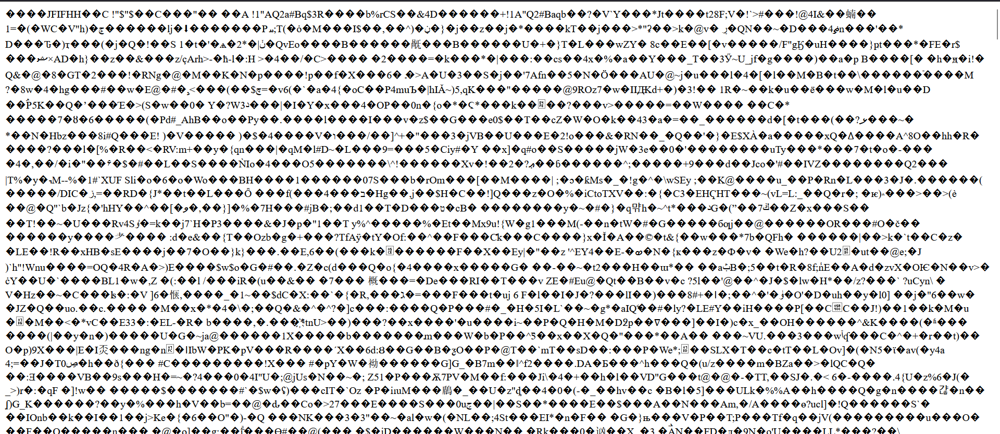

đầu tiên khi vào trong giao diện sẽ có như này

Thì mình nghĩ ngay đến upload file vul và đầu tiên
Ban đầu mình upload một file ảnh và mình sẽ có chức năng xem ảnh đấy
sau đó mình thử upload 1 file php có nội dung
                                        <?php phpinfo();?>
Thì bị chặn vì back-end xác nhận không phải file jpg mình cũng đổi cả contentype cũng không được
sau đó lên hacktrick sau khi thủ qua các kiểu null , viết hoa, cũng không được thì cuối cùng kiểu 

đã bypass thành công
và be cũng check phần đầu của file xem có đúng định dạng jpg không nữa nên mình dùng cách này

Sau khi list các file thì mình tìm được file flag trong flagmhx0x.txt

Flag như 1 anh mình hay coi thì có làm mới có ăn : @@
