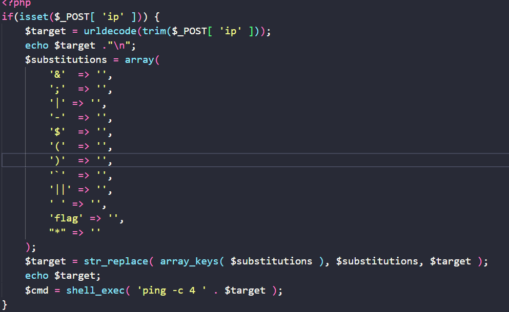
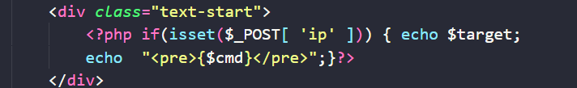
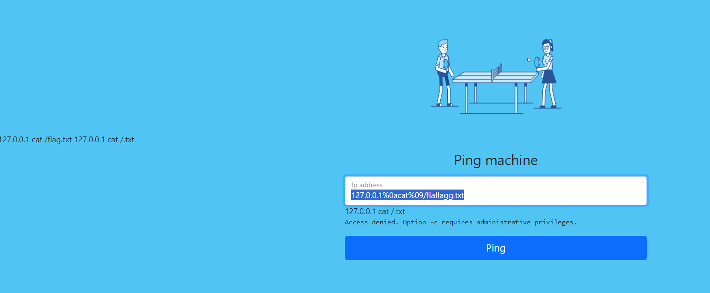

hello mọi người đây là chuỗi bài easy có trong cookie arena

đầu tiên đọc source mình thấy

+sẽ fillter một số kí tự đặc biệt quan trọng đã bị fillter
sau đó đã trả ra kết quả như sau

-- Theo như mình nhớ còn 1 vài kí tự nên mình searching được như sau
                                        127.0.0.1%0acat%09/flaflagg.txt
Giai thích: %0a là kí tự xuống dòng ngầm hiểu trong command thì dòng mới là một lệnh khác còn %09 là thay ch ".."
Như trong src ta thấy flag.txt nằm cùng cấp với index.php
vì fillter flag nên mình dùng như trên khi filter sẽ còn như sau

và đó là đã thành công thankiu :<