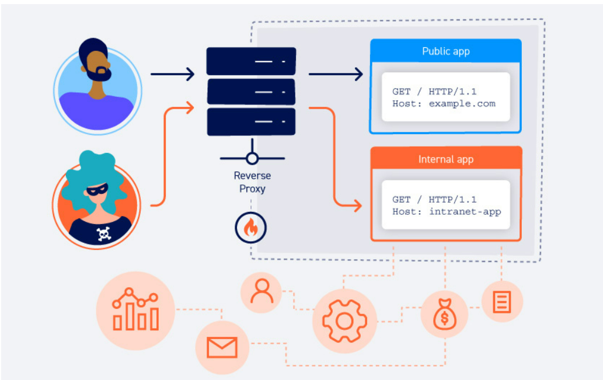

## Flow

Các cuộc tấn công tiêu đề Máy chủ HTTP khai thác các trang web dễ bị tấn công xử lý giá trị của tiêu đề Máy chủ theo cách không an toàn. Nếu máy chủ hoàn toàn tin cậy vào tiêu đề Máy chủ và không xác thực hoặc thoát tiêu đề đó đúng cách thì kẻ tấn công có thể sử dụng thông tin đầu vào này để chèn các tải trọng có hại nhằm thao túng hành vi phía máy chủ. Các cuộc tấn công liên quan đến việc đưa tải trọng trực tiếp vào tiêu đề Máy chủ thường được gọi là các cuộc tấn công "Tiêm tiêu đề máy chủ".

- Lỗ hổng này có thể dẫn đến một số các lỗ hổng khác như là :
+ Ngộ độc bộ đệm web
+ Lỗi logic nghiệp vụ trong chức năng cụ thể
+ SSRF dựa trên định tuyến
+ Các lỗ hổng phía máy chủ cổ điển, chẳng hạn như SQL injection

- lỗ hổng này phát sinh do giả định rằng têiêu đề Host : không thể được kiểm soát bởi người dùng dẫn đến việc tin cậy ngầm trong tiêu đề máy chủ dẫn đến việc

## Cách xác định và khai thác lỗ hổng tiêu đề HTTP Host
+ Sử dụng proxy hay dùng như là burp-suite và các công cụ kiểm tra thử công như là burp repeater và burp intruder
+ Bạn cần xác định xem liệu bạn có thể sửa đổi tiêu đề Máy chủ mà vẫn tiếp cận được ứng dụng đích theo yêu cầu của mình hay không. Nếu vậy, bạn có thể sử dụng tiêu đề này để thăm dò ứng dụng và quan sát xem điều này có ảnh hưởng gì đến phản hồi.
+ Đầu tiên là kiểm tra xem điều gì xảy ra khi mà bạn cung cấp một tên miền tùy ý, không được nhận dạng thông qua tiêu đề Máy chủ.

## Cung cấp tiêu đề Máy chủ tùy ý 
