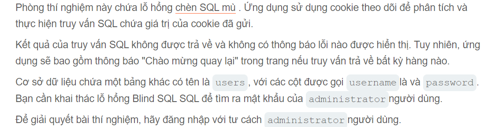
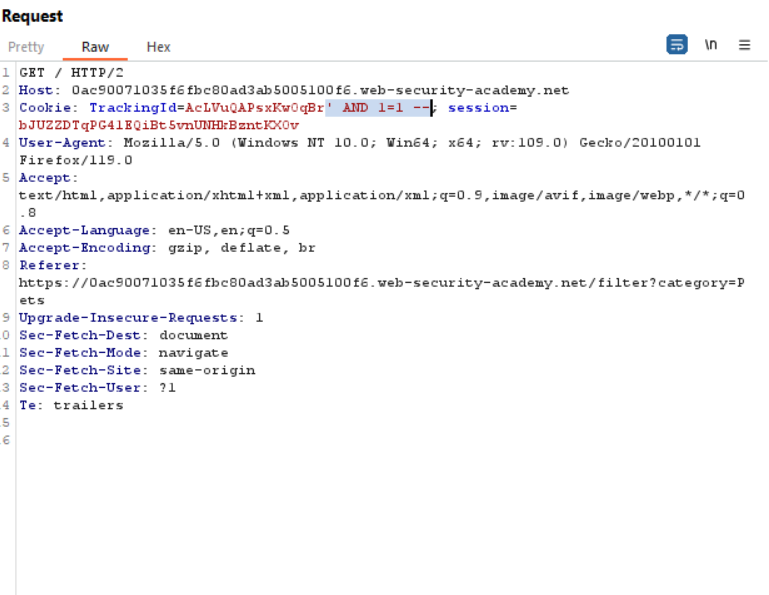
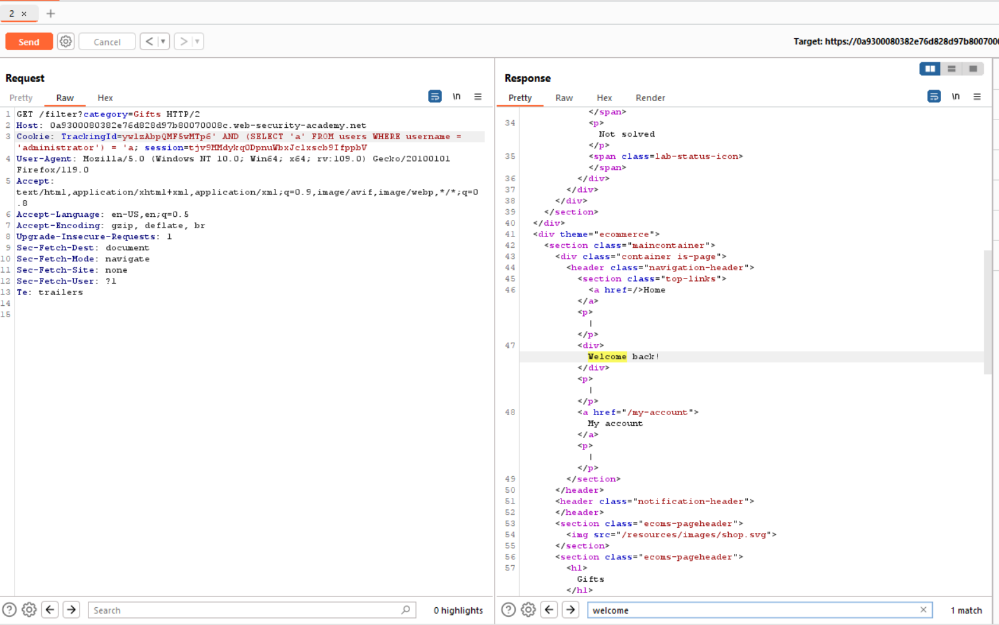

Chào mừng bạn đến với vấn đề mới cho series này đó là SQL blind Injection nó có cái tên đó vì bạn không thể nhìn thấy hay nhận biết nó:))

đề bài hôm nay sẽ là Chèn SQL mù với các phản hồi có điều kiện

sử dụng búp suite ta sẽ thấy được 

cookie sẽ chứa giá trị của trackingId để check xem có phải người dùng hay công và thực tế thì tôi có biết nó chwck như này:
                                        SELECT * FROM users WHERE trackingId = ${query};
Nếu mà truy vấn đúng sẽ trả ra welcome back :v đó là trường hợp này thôi chứ thường thì không ai làm thế
Lúc này thay vì dùng or như trước kia thfi bạn phải dùng AND để check điều kiện boolean
                                        query = ' AND 1=1 --
Lúc này vẫn trả ra welcome back vậy nên nó hoàn toàn có thể injection được
Bây giờ thì mình sẽ check xem độ dài của mật khẩu sẽ dài bao nhiều

                                        query = ' AND (SELECT 'a' FROM users WHERE usernames = 'administrator') = 'a
       Thì khi này Query của bạn sẽ trở thành 
                                        SELECT * FROM users WHERE trackingId = 'administrator' AND (SELECT 'a' FROM users WHERE username='administrator') = 'a';
    + vậy là nó đã trở thanh một câu query đúng và tôi test với burp

nó như này và các bạn thấy đó vẫn có "welcome back" tức là mọi thứ vẫn suôn sẻ
 
 + Công việc tiếp theo của bạn là check xem password có độ dài là bao nhiêu để tiến hành intruduce ở đoạn sau:))
                                        
                                        query = ' AND (SELECT 'a' FROM users WHERE usernames = 'administrator' AND LENGTH(password)> $number) = 'a
      Gía trị độ dài là bạn thử check từ  1 đến bao nhiêu đó và burp hỗ trợ nó trong intruduce chuyển number list từ 1 đến 100 bạn có thể dò với từ welcome back hoặc độ dài mã trả về cũng same nhau 
      Tiếp đó mình dò ra độ dài password có 20 kí tự
 ++ bây giờ có thủ thuật là lợi dụng hàm SUBSTRING để check lần lượt từng ki tự ở các vị trí @@
                                        query = ' AND (SELECT SUBSTRING(password, vị trí check bắt đầu, check bao nhiêu kí tự) FROM users WHERE usernames = 'administrator') = 'kí tự
  Bây giờ sử dụng cơ chế hủy duyệt đó là sniper hay gì đó mình quên rồi:)) cho 2 list 1 list number từ 1 đến 20 1 list từ abcd là tât scar những kí tự có thể làm password và để xem nhanh phải lọc welcome back trong respone lúc này sẽ check khá lâu ấy thì nó ra cái nhọc là bạn phải ghép 1-20 kí tự

  @@ chúc các bạn thành công
  Author : l3mh0cr3d