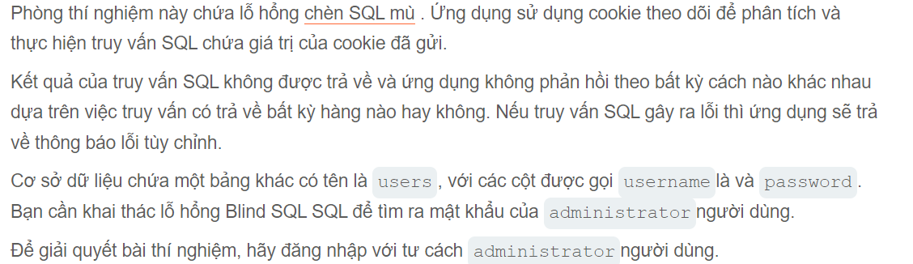

Xin chào các bạn lại là mình l3mh0cr3d đây

bài này sẽ có yêu cầu  Chèn SQL mù với các lỗi có điều kiện Chèn SQL mù với các lỗi có điều kiện
trong phòng này có vẻ khá giống phòng trước nhưng mà thay vì trả ra một cái gì đó nhận dạng thì cái này lại trả ra lỗi
  Yêu cầu như sau :

Đúng như tôi nghĩ thì nó sẽ không trả ra gì mà nhận biết chúng bằng cách response trang sever internal error
Và tương tự như lab trước @@ chúc các bạn thành công