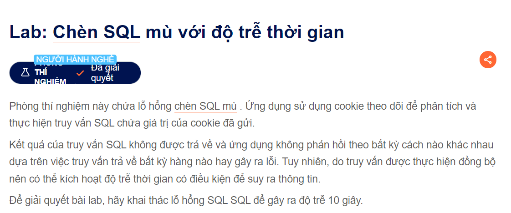

Hello welcome to my series about SQLi
Tody, i will share to you about BlindSqli:

Đây là đề bài 

Vì vậy có thể tìm hiểu về Time_base sql bình thường nếu mà dữ liệu nhỏ nhỏ thì khá là nhanh trong bài này thì dữ liệu nhỏ nên là khi mà ta truy vấn đúng thì chắc hơn 0...s một tí
Nên lợi dụng thời gian phản hồi của truy vấn SQL để biết nó đúng hay sai nên yêu cầu nó là <Để giải quyết bài lab, hãy khai thác lỗ hổng SQL SQL để gây ra độ trễ 10 giây.
>
Dùng burp như các lab trước vào cookie checkin
  thì ta sẽ xem bảng cheet seet của nó và tìm ra được
                                        ' || (SELECT pg_sleep(10)) -- 
                                        hoặc có thể như này ' || pg_sleep(10) --
Và kết quả nó sẽ load khoảng 10s và bạn đã thành công @@@
