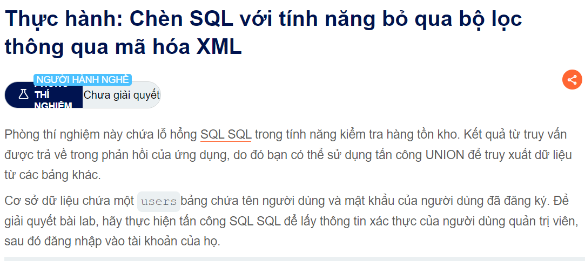
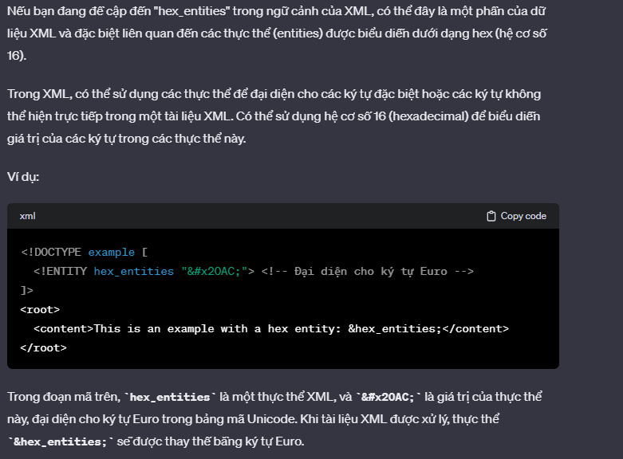

Hello các bạn chào mừng các bạn trở lại với series này của mình và đây là bài cuối cùng trong trong chuỗi SQLi

Đề bài hôm nay sẽ là bỏ qua sự filter của URL encode thì như các bạn biết thì mặc định thăng chrome nó sẽ chống lại XSS cơ bản bằng urlencode vì vậy cho nên ta phải tìm cách bypass nó @@
Đề bài của chúng ta sẽ là như thế này :

Cái này thì đại khái là nó muốn mình biết cách sử dụng của hack vector để bypass được cái WAF
++ Bắt trong burp và tới repeater thì chúng ta nhận ra được nó được gửi dưới dạng XML để truy vấn nên thử injection nó
                                        <storeId><@hex_entities>1 UNION SELECT username || '~' || password FROM users<@/hex_entities></storeId>
                                        Tìm hiểu đôi chút về hexentites

 Họ có nói và kí tự trong hexentites sẽ chuyển đổi lại thành ascii 2 

 Chúc các bạn thành công @@