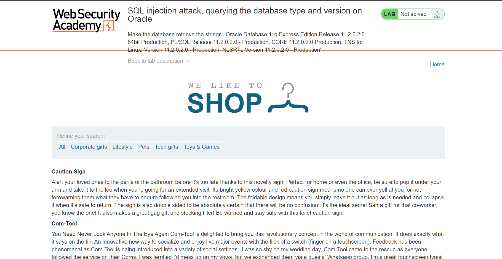
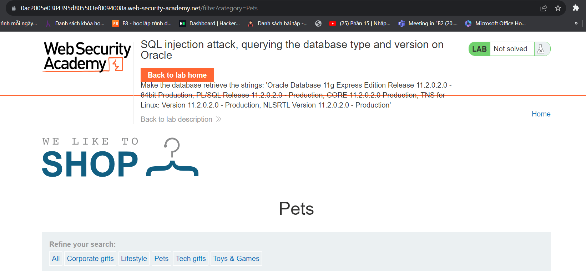
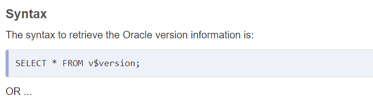
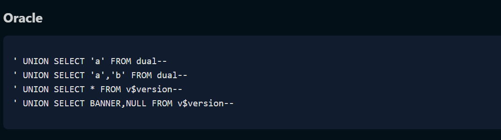

Đề bài của nó yêu cầu như thế này:
<Phòng thí nghiệm này chứa lỗ hổng chèn SQL trong bộ lọc danh mục sản phẩm. Bạn có thể sử dụng cuộc tấn công UNION để truy xuất kết quả từ truy vấn được chèn.>

<Để giải bài lab, hãy hiển thị chuỗi phiên bản cơ sở dữ liệu.>

++ Có vẻ như tác giả bắt chúng ta chèn vào thêm để hiển thị ra version của Oracle

Giao diện đơn giản như thế này. 

có thể thấy như những bài lab trước thì nó cũng sử dụng Query để trả ra kết quả dạng như :
                                        SELECT items from table where category = 'Pets'; sẽ trả ra Gitf đã phát hành;

                                        Lợi dụng lệnh UNION SELECT trả về cùng số cột 

                                        tìm hiểu 1 chút về SQL của oracle

Vì vậy thử để query = Pets' UNION SELECT v$version --
không được nên thử search

++ Kết quả sẽ thành công và ta có câu lệnh SELECT items from table where category = 'Pets' UNION SELECT BANNER,NULL FROM v$version--' ; sẽ trả ra Pets đã phát hành và version của SQL oracle

@@ Vậy là đã thành công chúc bạn thành công :)) WU By l3mh0cr3d