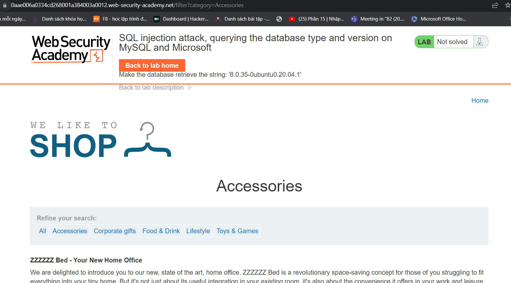
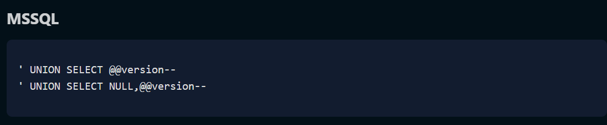
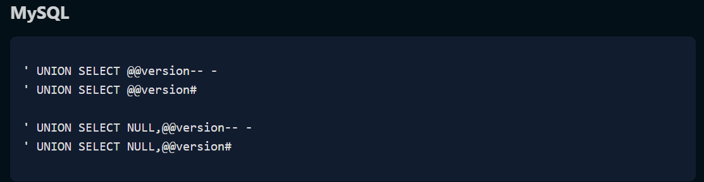

Lại là mình đây :)))
                                        Vẫn là vấn đề SQLi và hôm nay vấn đề của các bạn sẽ trên MySQL và Microsoft

++ Yêu cầu sương sương của lab này là:
                Phòng thí nghiệm này chứa lỗ hổng chèn SQL trong bộ lọc danh mục sản phẩm. Bạn có thể sử dụng cuộc tấn công UNION để truy xuất kết quả từ truy vấn được chèn.

Để giải bài lab, hãy hiển thị chuỗi phiên bản cơ sở dữ liệu.

-- có vẻ như là khá dài dòng đấy nhưng mà mình sẽ thực hiện nó như sau : à không dài dòng đâu:v
   
Thì bắt đầu nó cũng chẳng có gì đâu giống hệt với mấy phần trước thôi chỉ khác cái loại thôi :
   
   ban đầu mình thử cái đầu thì sever trả 500 mình nhận thấy là truy vấn sẽ trả ra 2 cột nên dùng cái thứ 2

++ query sẽ là ' UNION SELECT NULL,@@version-- và nó vẫn bị sai 

sau một hồi vật lộn với nó thì mình mới biết nó là Mysql chứ không phải là mssql ;

          %27+UNION+SELECT+@@version,+NULL%20--%20 và mình tìm được như này và câu truy vấn lúc này sẽ là :
                                        SELECT name, title FROM items WHERE categories = 'Lifestyle' UNION SELECT @@version, NULL -- 
                                        
<sẽ trả ra cả version nên kết quả đúng/>
  @@ Hơi lú chúc bạn thành công demo by l3mh0cr3d
  ++cheetSeet của pswger https://portswigger.net/web-security/sql-injection/cheat-sheet