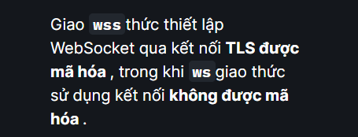

Xin chào mọi người đây là dạng lỗ hổng trong web socket á ^^
Thì như mình có dùng là web-socket để làm các đạn chat realtime như facebook-zalo-messenger,...
Các web-socket thường được bắt đầu qua HTTP bạn có thể thấy trong header http bình trường sẽ là connection là keep-alive các kiểu ấy là vẫn giữ kết nối
Kết nối này sẽ mở liên tục và cho đến khi máy chủ hoặc máy khách thực hiện nhắn tin hay hành động khác (có vẻ như gần giống phương thức UDP ở tầng transport) vậy nhỉ bởi vì độ trễ khá thấp ^^

## các websocket thường được tạo như sau: var ws = new WebSocket("wss://normal-website.com/ws");

//
GET /chat HTTP/1.1
Host: normal-website.com
Sec-WebSocket-Version: 13
Sec-WebSocket-Key: wDqumtseNBJdhkihL6PW7w==
Connection: keep-alive, Upgrade
Cookie: session=KOsEJNuflw4Rd9BDNrVmvwBF9rEijeE2
Upgrade: websocket
//
-- Đây là một header thiết lập kết nối websocket nhá :> Như có học ở môn mạng máy tính
 Khi mà chấp nhận kết nối máy chủ sẽ tra lại response là :
//
HTTP/1.1 101 Switching Protocols
Connection: Upgrade
Upgrade: websocket
Sec-WebSocket-Accept: 0FFP+2nmNIf/h+4BP36k9uzrYGk=
 //