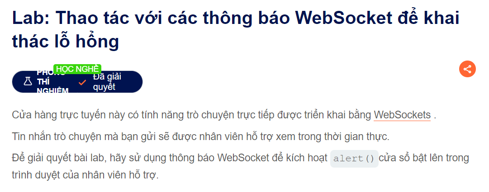

Như chúng ta đã biết thì ví dụ nếu người gửi gửi dữ liệu đến máy chủ thường thì realtime nên có thể checking nên ít khi có thể fillter XSS bài này mình làm từ 2 tháng trước nay mới viết lại :3 vì mình demo nó:z

Đề bài như sau :

-- Để giải quyết bài lab này thì chúng ta có thể dùng lỗ hổng XSS nha

View page source để xem logic xử lí ở client của chat trong route /chat.js

<code>
(function () {
    var chatForm = document.getElementById("chatForm");
    var messageBox = document.getElementById("message-box");
    var webSocket = openWebSocket();

    messageBox.addEventListener("keydown", function (e) {
        if (e.key === "Enter" && !e.shiftKey) {
            e.preventDefault();
            sendMessage(new FormData(chatForm));
            chatForm.reset();
        }
    });

    chatForm.addEventListener("submit", function (e) {
        e.preventDefault();
        sendMessage(new FormData(this));
        this.reset();
    });

    function writeMessage(className, user, content) {
        var row = document.createElement("tr");
        row.className = className

        var userCell = document.createElement("th");
        var contentCell = document.createElement("td");
        userCell.innerHTML = user;
        contentCell.innerHTML = (typeof window.renderChatMessage === "function") ? window.renderChatMessage(content) : content;

        row.appendChild(userCell);
        row.appendChild(contentCell);
        document.getElementById("chat-area").appendChild(row);
    }

    function sendMessage(data) {
        var object = {};
        data.forEach(function (value, key) {
            object[key] = htmlEncode(value);
        });

        openWebSocket().then(ws => ws.send(JSON.stringify(object)));
    }

    function htmlEncode(str) {
        if (chatForm.getAttribute("encode")) {
            return String(str).replace(/['"<>&\r\n\\]/gi, function (c) {
                var lookup = {'\\': '&#x5c;', '\r': '&#x0d;', '\n': '&#x0a;', '"': '&quot;', '<': '&lt;', '>': '&gt;', "'": '&#39;', '&': '&amp;'};
                return lookup[c];
            });
        }
        return str;
    }

    function openWebSocket() {
       return new Promise(res => {
            if (webSocket) {
                res(webSocket);
                return;
            }

            let newWebSocket = new WebSocket(chatForm.getAttribute("action"));

            newWebSocket.onopen = function (evt) {
                writeMessage("system", "System:", "No chat history on record");
                newWebSocket.send("READY");
                res(newWebSocket);
            }

            newWebSocket.onmessage = function (evt) {
                var message = evt.data;

                if (message === "TYPING") {
                    writeMessage("typing", "", "[typing...]")
                } else {
                    var messageJson = JSON.parse(message);
                    if (messageJson && messageJson['user'] !== "CONNECTED") {
                        Array.from(document.getElementsByClassName("system")).forEach(function (element) {
                            element.parentNode.removeChild(element);
                        });
                    }
                    Array.from(document.getElementsByClassName("typing")).forEach(function (element) {
                        element.parentNode.removeChild(element);
                    });

                    if (messageJson['user'] && messageJson['content']) {
                        writeMessage("message", messageJson['user'] + ":", messageJson['content'])
                    } else if (messageJson['error']) {
                        writeMessage('message', "Error:", messageJson['error']);
                    }
                }
            };

            newWebSocket.onclose = function (evt) {
                webSocket = undefined;
                writeMessage("message", "System:", "--- Disconnected ---");
            };
        });
    }
})();
</code>
Như các bạn thấy web sử dụng 1 hàm IIFE(hàm tự gọi trong js)
Nếu mà các bạn nhập tin nhắn vào trong form thì sau khi "keydown" hay "Enter" thi sẽ gửi tin nhắn đến sever theo cấu trúc của FormData và reset() là để cập nhập tin nhắn của client và trae về từ sever tương tự thì khi click submit event cũng diễn ra tương tự
-- Khi mà gửi các kí tự đặc biệt đã bị client mã hóa :

-- Nên ta có thể sử dụng burp để vượt qua nó
-- Trong burp ta chặn được 

Thay thế value bằng 1 '
Và 3 2 1 pùm 

Chúc các bạn thành công nha