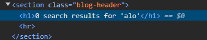

Xin chào các bạn đây sẽ là cái series mới của mình
Bài hôm này sẽ là bài nhỏ về reflect XSS nha

+ Đề bài của chsng ta như thế này :

  Cùng nhau bắt đầu nào (Let's go) @@
  có một giao diện như như thế này 
  Có một điều là những ô input là nơi lộng hành của xss :
-- Thử search một cái gì đó bất kì thử xem nào
  Khi mình gõ alo vào
  
Cùng inspect nó ra xem:))

Bạn có thể thấy nó như này điều đặc biệt là HTML có thể nhúng thẻ 

  ++ Thành công rồi:))
  Mình quên inspect lại thử nhưng mà chắc chắn nó là 
  <h1>No searching for ' đừng gõ tiếng việt nhá !!

Sau khi tu luyện một thời gian thì bạn sẽ hiểu cách dùng nó để tấn công mấy web cỏ
Và thế là đã thành công@@
Thank for watching 
Author : l3mh0cr3d