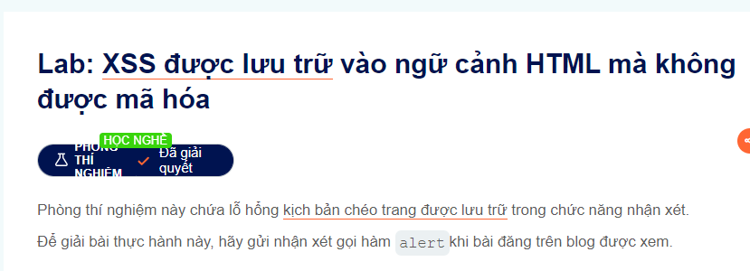
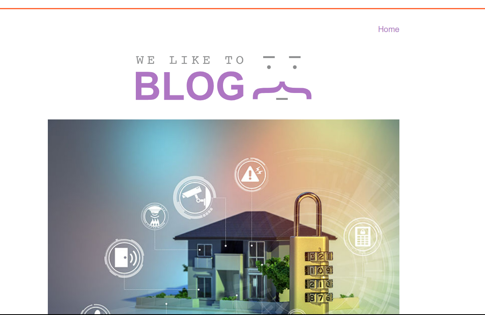
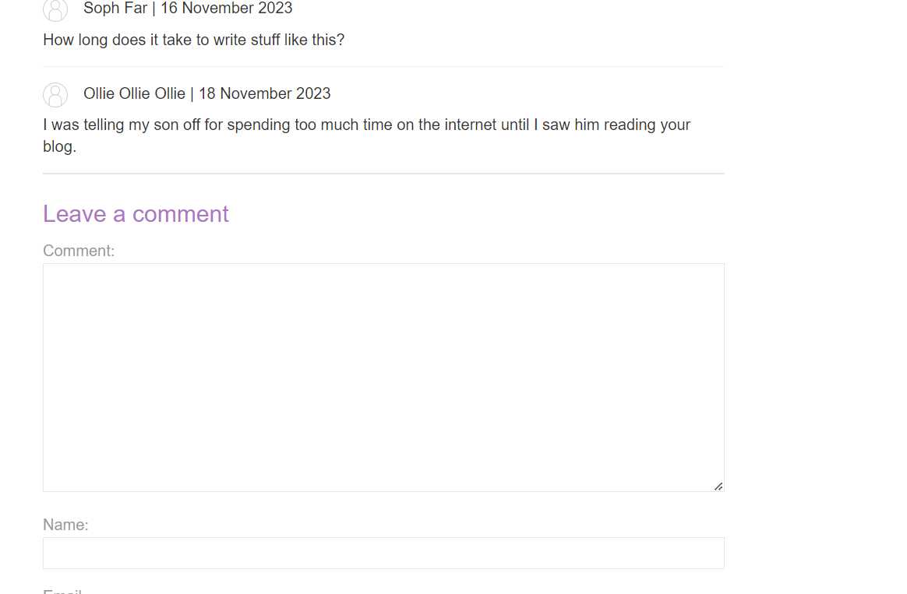
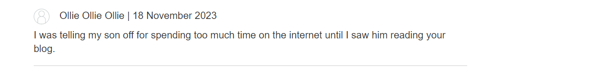

Welcome back 
This lab about store XSS
Then let's go:

Bài này thì nó cũng không bị mã hóa
Mấy dạng này thì chắc hẳn là nó kiểu như comment gì đó thường là comment

Bắt đầu lab thì không có gì đâu nên click vào view post đi

có một mớ như này và scroll xuống cuối để bình luận

có thể nhận thấy răng khsi mà các bạn comment xong gì nó sẽ lưu lại như này
 
Nên mình đoán chắc là nó chỉ ở Name và Comment thui ai không nhận biết được thì thử cả nhé@@
Đầu tiên thì thử với comment
 Thành công luôn:))
Hình như được cả 2 thì phải các bạn thử lại nhé

@@ chúc các bạn thành công