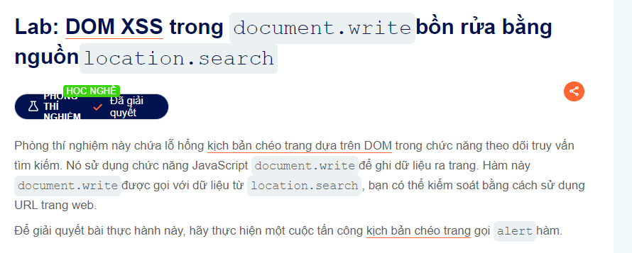
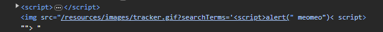
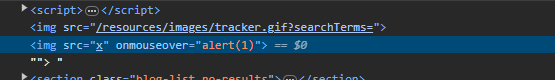

welcome back this lab about DOM XSS
Đây là yêu cầu của chúng ta 

Làm mình ngáo quá trường hợp này nó đã ulr encode đoạn giống lab1 rồi nên là không được thay vào đó nó cộng chuỗi hẳn vào cái ảnh để search luôn

Nó như này bây giờ tìm cách tách ra thôi

                                        ">
Với payload như trên khi bạn di chuột qua ảnh sẽ alert(1)
                                        ">
hoặc như này và nhiều lắm
chúc các bạn thành công @@