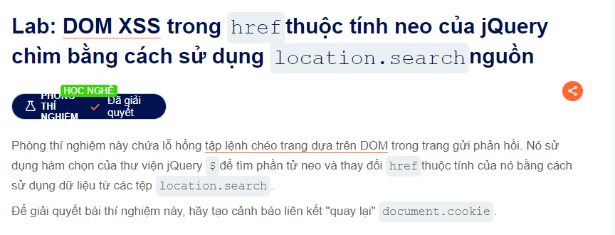

Chào mừng các bạn nha
Đề bài này sẽ là như này

Thì sương sương ra là nó sẽ sử dụng thư viện jQuery để thực hiện tìm kiếm
Vì đây yêu cầu là bạn khi click vào nút back thì nó xem hiển thị cookie của bạn
Trong submit feedback có một nút back thì khi click vào nó bạn về trang chủ
để ý rằng là phần returnPath sẽ là href của nút này nên hãy chuyển thành returnPath=javascript:alert(document.cookie)

Vậy là đã thành công
Congratulation @@
