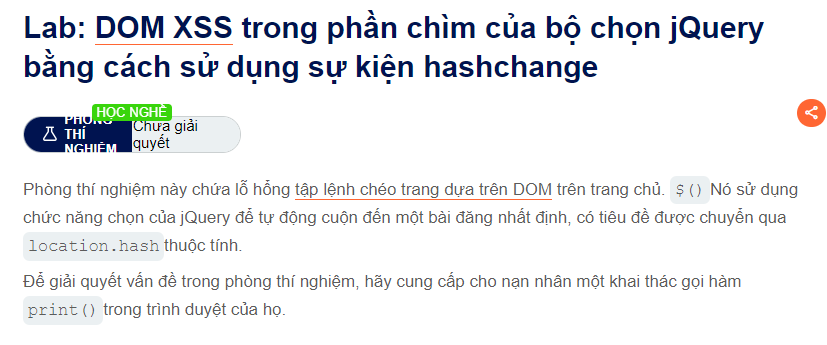

Chào các bạn đây là đề bài nha

Đây là một cơ chế của hàm TRONG jQuery dùng để tối ưu triair nghiệm người dùng tuy nhiên chúng ta có thể thực hiện injection nó bằng cách bắng theo 1 cái khung vào <iframe src="https://YOUR-LAB-ID.web-security-academy.net/#" onload="this.src+=''"></iframe>
thì khi người dùng vào này sẽ bị tấn công @@

Chúc bạn thành công