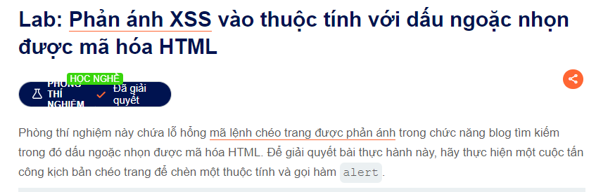
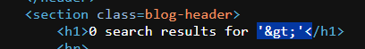
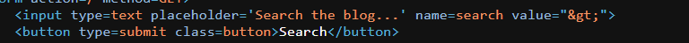

Xin chào !!!
 đây là đề bài của phần này
 
Đề có bảo là trong chức năng search có chứa lỗ hổng và dấu ">" thì sẽ bị urlEncode thành như này và tôi đã thử xem thì đúng thật

 Nhưng mà khoan đã chú ý ô input ở dưới
 

                                        <input type=text placeholder='Search the blog...' name=search value="&gt;">
thử injection chỗ này xem
     <input type=text placeholder='Search the blog...' name=search value="" onchange="alert(1)">
                                        " onmouseover="alert(1) or " onchange="alert(1)
Cả 2 phần này đều đúng nha

@@ chúc các bạn thành công