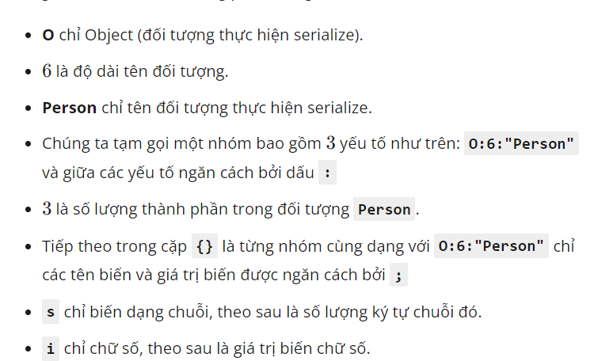
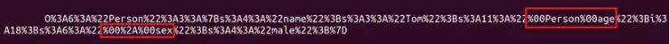

Xin chào tất cả các bạn nha đây sẽ là chuỗi bài và tìm hiểu Insecure deserialization vulnerability của mình với nhiều nguồn khác nhau nha :3

Trong lập trình hiện đại việc cần truyền tải các dữ liệu có cấu trúc lớn ngày càng cao chúng ta có nhiều kiểu như json sử dụng trong restAPI
#  Ngoài php ra thì trong một vài ngôn ngữ khác như php, java thì còn có một cấu trúc truyền tải dữ liệu là serialize
- Theo đó thì bên client sẽ gửi lên thông tin qua các phương thức thao tác web hiện đại lên server và server sẽ thực hiện mã hóa nó theo kiểu serialize
ví dụ :

<?php
    class Person {
        public $name = "Tom";
        private $age = 18;
        protected $sex = "male";
        public function hello() {
            echo "hello";
        }
    }
    $example = new Person();
    $example_ser = serialize($example);
    echo $example_ser;
-- sau khi thực hiện kết quả sẽ là 
O:6:"Person":3:{s:4:"name";s:3:"Tom";s:11:"Personage";i:18;s:6:"*sex";s:4:"male";}

Bạn có để ý thấy thằng s:11:"Personage" lại là Personage không
và s:6:"*sex" lại có dấu * không
Giải thích :
public: Không thay đổi
private:Có thêm các kí tự NULL dưới định dạng : %00+ tênObject+%00+tên thuộc tính
protected: có định dang %00+*+%00+tên thuộc tính
Có thể sử dụng url+encoded:

khi mà unserialize sẽ trả lại một object
